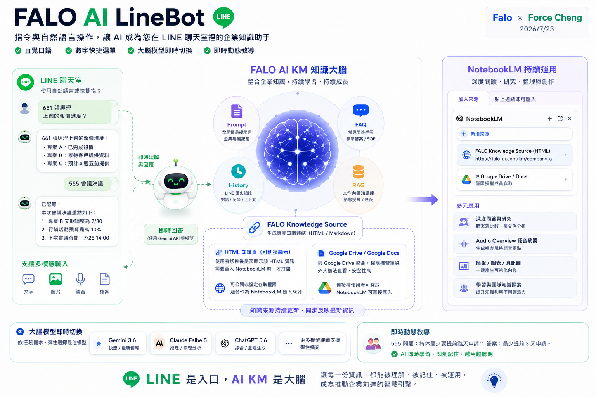

# FALO AI KM × NotebookLM 產品定位與合作觀念

## 📌 核心觀念：我們不重新發明輪子，我們讓輪子更好用

很多人常誤以為建立企業 AI 知識庫（KM），必須從頭到尾重新開發一套複雜的聊天與研究系統。

其實並非如此。**Google NotebookLM** 已經是一套極其成熟、強大的 AI 知識探索與整理工具。FALO AI KM 的核心價值，**從來就不是取代它，而是善用它、賦能它**。

FALO AI KM 專注於解決企業在「知識收集、整合管理與權限控管」上的痛點，讓企業能以最低的門檻、最安全的方式，將資料源源不斷地送入 NotebookLM。

---

## 🖼️ 全景概念圖：FALO AI KM × NotebookLM 協同運作

> *「LINE 是日常的入口，FALO AI KM 是持續學習的大腦，而 NotebookLM 是深度研究與創作的工具。」*

---

## 🤝 完美的互補分工，而非競爭

### 1. NotebookLM ── 您的知識研究與創作中心
* **擅長領域**：跨文件深度閱讀、研究分析、自動生成語音摘要（Audio Overview）、一鍵產出簡報與圖表。
* **核心價值**：使用者直接在 Google 原生且持續免費升級的 NotebookLM 介面中工作，享受全球頂尖的 AI 能力。

### 2. FALO AI KM ── 您的知識管理與整合入口
* **擅長領域**：串接 LINE 聊天室（支援文字、圖片、語音、檔案多模態輸入）、即時動態教導新知識、自動生成安全的 `FALO Knowledge Source` 專屬連結。
* **核心價值**：解決「如何收集日常零散知識」與「如何安全控管 Google Drive/Docs 權限」的問題，大幅降低企業導入的門檻。

---

## 💡 AI 時代的企業核心思維

**AI 時代，不一定每一項能力都需要企業自行開發。**

真正重要的是「整合成熟工具」，以最簡單的手段為使用者創造最大價值。善用全球頂尖平台、專注自身的核心管理價值，比重複開發已有的技術更有效率，也更具有長期競爭力。

---

## 🏁 總結

**FALO AI KM 不取代 NotebookLM，而是讓企業以更輕鬆、更安全、更有效率的方式運用 NotebookLM，將成熟的 AI 能力真正融入日常工作。**
